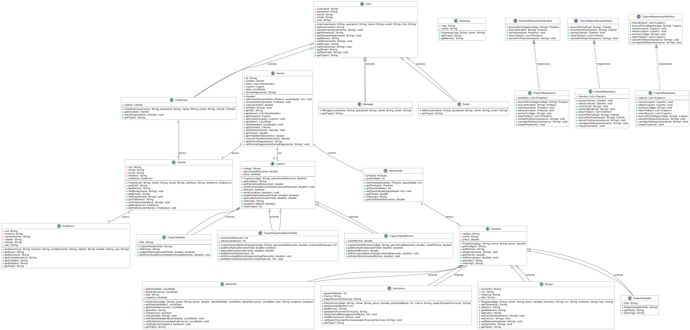

# DCC025 - Orientação a Objetos - Trabalho Final

**Nome:** Vitória Isabela de Oliveira
**Matrícula:** 202650697C

## Table of Contents

- [DCC025 - Orientação a Objetos - Trabalho Final](#dcc025---orientação-a-objetos---trabalho-final)
  - [Table of Contents](#table-of-contents)
  - [Descrição do Projeto](#descrição-do-projeto)
  - [Artefatos Entregues](#artefatos-entregues)
  - [Requisitos](#requisitos)
  - [Instruções para Compilação e Execução](#instruções-para-compilação-e-execução)
    - [Linux e macOS](#linux-e-macos)
    - [Windows](#windows)
  - [Documentação do Código](#documentação-do-código)
    - [Organização das Classes e Pacotes](#organização-das-classes-e-pacotes)
    - [Conceitos de Orientação a Objetos](#conceitos-de-orientação-a-objetos)
      - [Herança](#herança)
      - [Polimorfismo](#polimorfismo)
      - [Classes Abstratas](#classes-abstratas)
      - [Interfaces](#interfaces)
      - [Coleções](#coleções)
      - [Tratamento de Exceções](#tratamento-de-exceções)
      - [Leitura e Escrita em Arquivos](#leitura-e-escrita-em-arquivos)
      - [Interface Gráfica (GUI)](#interface-gráfica-gui)
      - [Testes de Unidade](#testes-de-unidade)
    - [Decisões Arquiteturais, Padrões e Conceitos](#decisões-arquiteturais-padrões-e-conceitos)
    - [Dificuldades Encontradas e Soluções](#dificuldades-encontradas-e-soluções)
  - [Diagrama de Classes UML](#diagrama-de-classes-uml)
  - [Considerações Finais](#considerações-finais)

## Descrição do Projeto

Este projeto implementa um sistema de e-commerce como trabalho final da disciplina DCC025 - Orientação a Objetos. Ele abrange funcionalidades de gestão de produtos, cupons de desconto, clientes e vendas, com diferentes perfis de usuário (gerente, vendedor e cliente). O sistema visa simular um ambiente de loja online onde diferentes atores possuem diferentes permissões e responsabilidades.

## Artefatos Entregues

*   **Código-fonte:** Diretório `src` contendo todo o código-fonte do projeto (arquivos `.java`).
*   *   **User Hitories (USs):** Estão no  arquivo _User History -Trabalho final - DCC025_ no diretório raiz desse repositório.
*   **Arquivo de Build:** Arquivo `pom.xml` para gerenciamento e compilação do projeto com Maven.
*   **Documentação:** Este arquivo `README.md` contendo detalhes sobre a arquitetura do sistema, estruturas de dados utilizadas, decisões de projeto, justificativas para o uso de conceitos de orientação a objetos, e instruções para compilação e execução.
*   **Diagrama UML:** Um diagrama UML representando o relacionamento entre as classes do projeto (incluído ao final deste documento).
*   **Executáveis:** Os arquivos `.json` usados para persistência e carregamento de dados.

## Requisitos

*   Java Development Kit (JDK) versão 17 ou superior.
*   Apache Maven (versão 3.6 ou superior) instalado e configurado.

## Instruções para Compilação e Execução

O projeto utiliza o Apache Maven como sistema de build. As instruções abaixo descrevem como compilar e executar o projeto em diferentes sistemas operacionais.

**Observação:** Antes de começar, certifique-se de que a variável de ambiente `JAVA_HOME` esteja configurada corretamente, apontando para o diretório de instalação do JDK.

### Linux e macOS

1.  **Abra um terminal:** Navegue até o diretório raiz do projeto (onde o arquivo `pom.xml` está localizado).

2.  **Compile o projeto:** Execute o seguinte comando:

    ```bash
    ./mvnw clean install
    ```

    Este comando irá baixar as dependências necessárias, compilar o código-fonte e criar um arquivo JAR executável.

3.  **Execute o projeto:** Após a compilação bem-sucedida, execute o seguinte comando:

    ```bash
    ./mvnw exec:java -Dexec.mainClass="br.ufjf.dcc.dcc025.dcc025_ecommerce.Main"
    ```

    Este comando irá executar a classe `Main` do seu projeto, iniciando o aplicativo.

### Windows

> Eu compilei usando interface gráfica, através dos atalhos da IDE Netbeans.

1.  **Abra o Prompt de Comando ou PowerShell:** Navegue até o diretório raiz do projeto (onde o arquivo `pom.xml` está localizado).

2.  **Compile o projeto:** Execute o seguinte comando:

    ```bash
    mvnw.cmd clean install
    ```

    Este comando irá baixar as dependências necessárias, compilar o código-fonte e criar um arquivo JAR executável.

3.  **Execute o projeto:** Após a compilação bem-sucedida, execute o seguinte comando:

    ```bash
    mvnw.cmd exec:java -Dexec.mainClass="br.ufjf.dcc.dcc025.dcc025_ecommerce.Main"
    ```

    Este comando irá executar a classe `Main` do seu projeto, iniciando o aplicativo.

## Documentação do Código

A documentação a seguir contém informações relevantes para entender a arquitetura do sistema, as estruturas de dados utilizadas e as decisões de projeto tomadas, bem como as justificativas para o uso de conceitos de orientação a objetos.

### Organização das Classes e Pacotes

O projeto foi organizado em pacotes que refletem as diferentes camadas e responsabilidades dentro do sistema de e-commerce:

*   `br.ufjf.dcc.dcc025.dcc025_ecommerce.dominio`: Contém as classes de domínio que representam as entidades do sistema (Produto, Cliente, Venda, Cupom, etc.) e seus relacionamentos. Essas classes definem a lógica de negócios e as regras de como as informações são estruturadas e manipuladas.
*   `br.ufjf.dcc.dcc025.dcc025_ecommerce.excecoes`: Define classes de exceção customizadas para tratamento de situações específicas do negócio (ex: `CupomInvalidoException`).
*   `br.ufjf.dcc.dcc025.dcc025_ecommerce.gui`: Contém as classes responsáveis pela interface gráfica do sistema, construída com Swing. Cada classe representa um painel ou janela específica (ex: `ProdutoPanel`, `VendaPanel`, `LoginFrame`).
*   `br.ufjf.dcc.dcc025.dcc025_ecommerce.persistence`: Contém classes responsáveis pela persistência dos dados, utilizando arquivos JSON para armazenar e recuperar informações. Inclui serializadores e deserializadores customizados do Gson para lidar com tipos complexos como `LocalDate` e polimorfismo.
*   `br.ufjf.dcc.dcc025.dcc025_ecommerce.repository`: Contém as classes de repositório que abstraem o acesso aos dados, separando a lógica de negócios do acesso físico aos dados. Utiliza interfaces para definir contratos e implementações concretas (ex: `ProdutoRepositoryInterface` e `ProdutoRepository`).
*   `br.ufjf.dcc.dcc025.dcc025_ecommerce`: Contém a classe `Main` que inicializa e executa o sistema, bem como a classe `GestorVendas`, que centraliza a lógica de negócios.

### Conceitos de Orientação a Objetos

A seguir, uma descrição de como os principais conceitos de Orientação a Objetos foram explorados no projeto:

#### Herança

*   **Motivação:** Utilizei herança para modelar a hierarquia de tipos de produtos (Alimento, Eletrônico, Roupa) a partir de uma classe base `Produto`. Isso permitiu reaproveitar o código comum (código, nome, preço) e adicionar atributos específicos para cada tipo de produto. A herança também é utilizada na hierarquia de usuários (Manager, Seller, ClientUser), derivando de uma classe base `User`, promovendo a reutilização de código e a organização da estrutura do sistema.
*   **Arquivos e Linhas:**
    *   `src/br/ufjf/dcc/dcc025/dcc025_ecommerce/dominio/Alimento.java`: Classe `Alimento` herda de `Produto`.
    *   `src/br/ufjf/dcc/dcc025/dcc025_ecommerce/dominio/Eletronico.java`: Classe `Eletronico` herda de `Produto`.
    *   `src/br/ufjf/dcc/dcc025/dcc025_ecommerce/dominio/Roupa.java`: Classe `Roupa` herda de `Produto`.
    *   `src/br/ufjf/dcc/dcc025/dcc025_ecommerce/dominio/Manager.java`: Classe `Manager` herda de `User`.
    *   `src/br/ufjf/dcc/dcc025/dcc025_ecommerce/dominio/Seller.java`: Classe `Seller` herda de `User`.
    *   `src/br/ufjf/dcc/dcc025/dcc025_ecommerce/dominio/ClientUser.java`: Classe `ClientUser` herda de `User`.
    *   `src/br/ufjf/dcc/dcc025/dcc025_ecommerce/dominio/CupomValorMinimo.java`: Classe `CupomValorMinimo` herda de `Cupom`.
    *   `src/br/ufjf/dcc/dcc025/dcc025_ecommerce/dominio/CupomQuantidadeLimitada.java`: Classe `CupomQuantidadeLimitada` herda de `Cupom`.

#### Polimorfismo

*   **Motivação:** Utilizei polimorfismo para permitir que diferentes tipos de produtos e cupons sejam tratados de forma genérica. Por exemplo, o método `calcularTotal()` na classe `Venda` interage com diferentes tipos de produtos através da interface `Produto`, sem precisar conhecer os tipos específicos. A classe abstrata `Cupom` possui métodos abstratos como `podeSerAplicado()` e `setPercentualDesconto()` que são implementados de maneira diferente nas subclasses, permitindo o uso polimórfico no cálculo de descontos.
*   **Arquivos e Linhas:**
    *   `src/br/ufjf/dcc/dcc025/dcc025_ecommerce/dominio/Venda.java`: Método `adicionarItem()` adiciona diferentes tipos de `Produto` a uma venda.
    *   `src/br/ufjf/dcc/dcc025/dcc025_ecommerce/dominio/Cupom.java`: Métodos abstratos `podeSerAplicado()` e `aplicarDesconto()` com implementações polimórficas nas subclasses.
    *   `src/br/ufjf/dcc/dcc025/dcc025_ecommerce/persistence/CupomDeserializer.java`: Deserializa diferentes tipos de `Cupom` de arquivos JSON.

#### Classes Abstratas

*   **Motivação:** Utilizei classes abstratas `Produto` e `Cupom` para definir um contrato comum para subclasses, forçando a implementação de métodos essenciais e impedindo a instanciação direta da classe base. Isso garante a consistência do comportamento e facilita a extensibilidade do sistema.
*   **Arquivos e Linhas:**
    *   `src/br/ufjf/dcc/dcc025/dcc025_ecommerce/dominio/Produto.java`: Classe abstrata `Produto` define o contrato para os diferentes tipos de produtos.
    *   `src/br/ufjf/dcc/dcc025/dcc025_ecommerce/dominio/Cupom.java`: Classe abstrata `Cupom` define o contrato para os diferentes tipos de cupons.
    *   `src/br/ufjf/dcc/dcc025/dcc025_ecommerce/dominio/User.java`: Classe abstrata `User` define o contrato para os diferentes tipos de usuários.

#### Interfaces

*   **Motivação:** Utilizei interfaces (ex: `ProdutoRepositoryInterface`, `ClienteRepositoryInterface`) para definir contratos de comportamento que as classes de repositório devem implementar. Isso promove o baixo acoplamento e permite que diferentes implementações de repositório sejam utilizadas sem afetar o resto do sistema.
*   **Arquivos e Linhas:**
    *   `src/br/ufjf/dcc/dcc025/dcc025_ecommerce/repository/ProdutoRepositoryInterface.java`: Interface que define o contrato para classes que gerenciam produtos.
    *   `src/br/ufjf/dcc/dcc025/dcc025_ecommerce/repository/ProdutoRepository.java`: Implementação concreta da interface `ProdutoRepositoryInterface`.
    *   `src/br/ufjf/dcc/dcc025/dcc025_ecommerce/repository/ClienteRepositoryInterface.java`: Interface que define o contrato para classes que gerenciam clientes.
    *   `src/br/ufjf/dcc/dcc025/dcc025_ecommerce/repository/ClienteRepository.java`: Implementação concreta da interface `ClienteRepositoryInterface`.
    *   `src/br/ufjf/dcc/dcc025/dcc025_ecommerce/repository/UserRepositoryInterface.java`: Interface que define o contrato para classes que gerenciam usuários.
    *   `src/br/ufjf/dcc/dcc025/dcc025_ecommerce/repository/UserRepository.java`: Implementação concreta da interface `UserRepositoryInterface`.
    *   `src/br/ufjf/dcc/dcc025/dcc025_ecommerce/repository/CupomRepositoryInterface.java`: Interface que define o contrato para classes que gerenciam cupons.
    *   `src/br/ufjf/dcc/dcc025/dcc025_ecommerce/repository/CupomRepository.java`: Implementação concreta da interface `CupomRepositoryInterface`.
    *   `src/br/ufjf/dcc/dcc025/dcc025_ecommerce/repository/VendaRepositoryInterface.java`: Interface que define o contrato para classes que gerenciam vendas.
    *   `src/br/ufjf/dcc/dcc025/dcc025_ecommerce/repository/VendaRepository.java`: Implementação concreta da interface `VendaRepositoryInterface`.

#### Coleções

*   **Motivação:** Coleções são fundamentais para armazenar e manipular listas de produtos, clientes, vendas, cupons, etc. Utilizei `List` e `Map` para organizar e gerenciar esses dados de forma eficiente.
*   **Arquivos e Linhas:**
    *   `src/br/ufjf/dcc/dcc025/dcc025_ecommerce/repository/ProdutoRepository.java`: Utiliza `List<Produto>` para armazenar os produtos.
    *   `src/br/ufjf/dcc/dcc025/dcc025_ecommerce/dominio/Venda.java`: Utiliza `List<ItemVenda>` para armazenar os itens da venda.
    *   `src/br/ufjf/dcc/dcc025/dcc025_ecommerce/repository/CupomRepository.java`: Utiliza `List<Cupom>` para armazenar os cupons.

#### Tratamento de Exceções

*   **Motivação:** Implementei tratamento de exceções para lidar com situações inesperadas, como a tentativa de adicionar um produto com um código já existente ou a aplicação de um cupom inválido. Isso garante que o sistema seja robusto e que erros sejam tratados de forma apropriada, sem interromper a execução.
*   **Arquivos e Linhas:**
    *   `src/br/ufjf/dcc/dcc025/dcc025_ecommerce/repository/ProdutoRepository.java`: Lança `IllegalArgumentException` ao tentar salvar um produto com um código já existente.
    *   `src/br/ufjf/dcc/dcc025/dcc025_ecommerce/dominio/Venda.java`: Lança `CupomInvalidoException` quando um cupom não pode ser aplicado.
    *   `src/br/ufjf/dcc/dcc025/dcc025_ecommerce/gui/VendaPanel.java`: Lida com `CupomInvalidoException` na finalização da venda.
    *   `src/br/ufjf/dcc/dcc025/dcc025_ecommerce/persistence/Persistencia.java`: Implementa tratamento de exceções ao carregar dados de arquivos, garantindo que erros de leitura não interrompam o funcionamento do sistema.

#### Leitura e Escrita em Arquivos

*   **Motivação:** Utilizei leitura e escrita em arquivos JSON para persistir os dados do sistema (produtos, clientes, cupons, usuários e vendas). Isso permite que os dados sejam armazenados de forma organizada e recuperados quando o sistema é reiniciado. A biblioteca Gson foi utilizada para facilitar a serialização e deserialização de objetos Java em formato JSON. Implementei serializadores e deserializadores customizados para lidar com tipos complexos como `LocalDate` e polimorfismo, garantindo a correta persistência e recuperação dos dados.
*   **Arquivos e Linhas:**
    *   `src/br/ufjf/dcc/dcc025/dcc025_ecommerce/persistence/Persistencia.java`: Classe responsável por carregar e salvar dados em arquivos JSON.
    *   `src/br/ufjf/dcc/dcc025/dcc025_ecommerce/repository/ProdutoRepository.java`: Métodos `salvarEmArquivo()` e `carregarDeArquivo()` para persistir os produtos.
    *   `src/br/ufjf/dcc/dcc025/dcc025_ecommerce/persistence/LocalDateAdapter.java`: Serializador e deserializador customizado para `LocalDate`.
    *   `src/br/ufjf/dcc/dcc025/dcc025_ecommerce/persistence/CupomDeserializer.java`: Deserializador customizado para polimorfismo em `Cupom`.
    *   `src/br/ufjf/dcc/dcc025/dcc025_ecommerce/persistence/CupomSerializer.java`: Serializador customizado para polimorfismo em `Cupom`.
    *   `src/br/ufjf/dcc/dcc025/dcc025_ecommerce/persistence/ProdutoDeserializer.java`: Deserializador customizado para polimorfismo em `Produto`.
    *   `src/br/ufjf/dcc/dcc025/dcc025_ecommerce/persistence/ProdutoSerializer.java`: Serializador customizado para polimorfismo em `Produto`.
    *   `src/br/ufjf/dcc/dcc025/dcc025_ecommerce/persistence/UserDeserializer.java`: Deserializador customizado para polimorfismo em `User`.
    *   `src/br/ufjf/dcc/dcc025/dcc025_ecommerce/persistence/VendaDeserializer.java`: Deserializador customizado para polimorfismo em `Venda`.
    *   `src/br/ufjf/dcc/dcc025/dcc025_ecommerce/persistence/ItemVendaDeserializer.java`: Deserializador customizado para polimorfismo em `ItemVenda`.

#### Interface Gráfica (GUI)

*   **Motivação:** UtilizeI Swing para construir a interface gráfica do sistema. Isso permitiu criar uma aplicação desktop interativa e fácil de usar para gerenciar os diferentes aspectos do e-commerce. Utilizei diferentes painéis para organizar as funcionalidades e facilitar a navegação do usuário. A UI foi projetada para ser responsiva e adaptável aos diferentes perfis de usuário.
*   **Arquivos e Linhas:**
    *   `src/br/ufjf/dcc/dcc025/dcc025_ecommerce/gui/ProdutoPanel.java`: Painel para gerenciar produtos.
    *   `src/br/ufjf/dcc/dcc025/dcc025_ecommerce/gui/VendaPanel.java`: Painel para gerenciar vendas.
    *   `src/br/ufjf/dcc/dcc025/dcc025_ecommerce/gui/CupomPanel.java`: Painel para gerenciar cupons.
    *   `src/br/ufjf/dcc/dcc025/dcc025_ecommerce/gui/ClientePanel.java`: Painel para gerenciar clientes.
    *   `src/br/ufjf/dcc/dcc025/dcc025_ecommerce/gui/MainFrame.java`: Janela principal que organiza os painéis.
    *   `src/br/ufjf/dcc/dcc025/dcc025_ecommerce/gui/RelatorioPanel.java`: Painel para exibir relatórios.
    *   `src/br/ufjf/dcc/dcc025/dcc025_ecommerce/gui/LoginFrame.java`: Janela para realizar login.

#### Testes de Unidade

*   **Motivação:** A implementação de testes unitários foi essencial para garantir a robustez e a confiabilidade do sistema. Os testes foram criados para validar o comportamento das classes de domínio e dos repositórios, assegurando que a lógica de negócios seja executada corretamente.
*   **Implementação:** Os testes unitários foram implementados utilizando JUnit. Os testes cobrem as seguintes classes principais:
    *   `src/br/ufjf/dcc/dcc025/dcc025_ecommerce/dominio/AlimentoTest.java`: Testa a criação de um produto do tipo alimento.
    *   `src/br/ufjf/dcc/dcc025/dcc025_ecommerce/dominio/ClienteTest.java`: Testa a criação de um cliente.
    *   `src/br/ufjf/dcc/dcc025/dcc025_ecommerce/dominio/CupomQuantidadeLimitadaTest.java`: Testa a criação de um cupom com quantidade limitada.
    *   `src/br/ufjf/dcc/dcc025/dcc025_ecommerce/dominio/CupomValorMinimoTest.java`: Testa a criação de um cupom com valor mínimo.
    *   `src/br/ufjf/dcc/dcc025/dcc025_ecommerce/dominio/EletronicoTest.java`: Testa a criação de um produto do tipo eletrônico.
    *   `src/br/ufjf/dcc/dcc025/dcc025_ecommerce/dominio/EnderecoTest.java`: Testa a criação de um endereço.
    *   `src/br/ufjf/dcc/dcc025/dcc025_ecommerce/dominio/ItemVendaTest.java`: Testa a criação de um item de venda.
    *   `src/br/ufjf/dcc/dcc025/dcc025_ecommerce/dominio/ProdutoTest.java`: Testa a criação de um produto.
    *   `src/br/ufjf/dcc/dcc025/dcc025_ecommerce/dominio/RoupaTest.java`: Testa a criação de um produto do tipo roupa.
    *   `src/br/ufjf/dcc/dcc025/dcc025_ecommerce/dominio/VendaTest.java`: Testa a criação de uma venda.
    *   `src/br/ufjf/dcc/dcc025/dcc025_ecommerce/gui/CupomPanelTest.java`: Testa a criação do cupom no painel.
    *   `src/br/ufjf/dcc/dcc025/dcc025_ecommerce/gui/RelatorioPanelTest.java`: Testa a criação de um relatório no painel.
    *   `src/br/ufjf/dcc/dcc025/dcc025_ecommerce/repository/ClienteRepositoryTest.java`: Testa a criação de um cliente no repositório.
    *   `src/br/ufjf/dcc/dcc025/dcc025_ecommerce/repository/CupomRepositoryTest.java`: Testa a criação de um cupom no repositório.
    *   `src/br/ufjf/dcc/dcc025/dcc025_ecommerce/repository/GestorVendasTest.java`: Testa a criação de um gestor de vendas no repositório.
    *   `src/br/ufjf/dcc/dcc025/dcc025_ecommerce/repository/PersistenciaTest.java`: Testa a criação da persistência do repositório.
    *   `src/br/ufjf/dcc/dcc025/dcc025_ecommerce/repository/ProdutoRepositoryTest.java`: Testa a criação de um produto no repositório.
    *   `src/br/ufjf/dcc/dcc025/dcc025_ecommerce/repository/UserRepositoryTest.java`: Testa a criação de um usuário no repositório.
    *   `src/br/ufjf/dcc/dcc025/dcc025_ecommerce/repository/VendaRepositoryTest.java`: Testa a criação de uma venda no repositório.
 
    

*   **Benefícios:** Os testes unitários permitiram identificar e corrigir erros precocemente, garantindo que o sistema funcione conforme o esperado. Além disso, os testes servem como documentação do código, facilitando a compreensão e a manutenção do sistema.

### Decisões Arquiteturais, Padrões e Conceitos

*   **Arquitetura:**
    *   **Arquitetura em Camadas:** O projeto segue uma arquitetura em camadas, separando a lógica de apresentação (GUI), a lógica de negócios (Domínio), o acesso a dados (Repositório) e a persistência (Persistência).  Esta separação facilita a manutenção, o teste e a evolução do sistema, permitindo que cada camada seja alterada independentemente das outras, aderindo ao princípio da responsabilidade única (SRP).
    *   **Arquivos e Linhas:** A estrutura de pacotes reflete essa arquitetura: `dominio`, `gui`, `repository`, `persistence`.

*   **Padrões de Projeto:**
    *   **Singleton:** Os repositórios (ex: `ProdutoRepository`, `ClienteRepository`) são implementados como Singletons.
        *   **Motivação:** Garante que exista apenas uma instância de cada repositório, controlando o acesso aos dados e evitando inconsistências.
        *   **Arquivos e Linhas:** Ver o método `getInstance()` nas classes dos repositórios.
    *   **Repository:** O padrão Repository abstrai o acesso aos dados, separando a lógica de negócios do acesso físico aos dados.
        *   **Motivação:** Permite que a lógica de negócios seja testada independentemente do mecanismo de persistência e facilita a troca do mecanismo de persistência sem afetar o resto do sistema.
        *   **Arquivos e Linhas:** Interfaces `ProdutoRepositoryInterface`, `ClienteRepositoryInterface`, etc., e suas implementações.
    *   **Adapter:** Utilizado para serializar e deserializar `LocalDate` com o Gson.
        *   **Motivação:** Permite que o Gson lide com tipos que ele não suporta nativamente.
        *   **Arquivos e Linhas:** `src/br/ufjf/dcc/dcc025/dcc025_ecommerce/persistence/LocalDateAdapter.java`
     * **Factory:** Utilizado para criar as instâncias dos cupons (CupomQuantidadeLimitada ou CupomValorMinimo)
        *   **Motivação:** Permite desacoplar a parte de criação de objetos, facilitando modificações futuras.

*   **Conceitos SOLID:**
    *   **Princípio da Responsabilidade Única (SRP):** Cada classe e método tem uma única responsabilidade. Por exemplo, a classe `Produto` é responsável por representar um produto, e a classe `ProdutoRepository` é responsável por gerenciar a persistência de produtos.
    *   **Princípio Aberto/Fechado (OCP):** O sistema é aberto para extensão, mas fechado para modificação. A herança e o polimorfismo permitem adicionar novos tipos de produtos e cupons sem modificar o código existente.
    *   **Princípio da Substituição de Liskov (LSP):** As subclasses de `Produto` e `Cupom` podem ser substituídas por suas classes base sem afetar o comportamento do sistema.
    *   **Princípio da Segregação da Interface (ISP):** As interfaces de repositório são específicas para cada entidade, evitando que as classes implementem métodos que não utilizam.
    *   **Princípio da Inversão da Dependência (DIP):** As classes de alto nível (ex: lógica de negócios) não dependem das classes de baixo nível (ex: acesso a dados). Ambas dependem de abstrações (interfaces).

*   **Clean Code:**
    *   **Nomes Significativos:** Classes, métodos e variáveis possuem nomes claros e descritivos, facilitando a compreensão do código.
    *   **Funções Pequenas:** Métodos são pequenos e focados em uma única tarefa.
    *   **Comentários Explicativos:** Comentários são utilizados para explicar o "porquê" do código, e não o "o quê".

*   **Persistência de Dados:**
    *   **Justificativa:** Optei pelo uso de arquivos JSON devido à simplicidade e facilidade de implementação, especialmente para um projeto de escopo limitado. Arquivos JSON permitem salvar e recuperar dados de forma legível e sem a necessidade de configurar um banco de dados complexo.
    *   **Considerações:** Em um cenário real de produção, essa escolha seria inadequada devido a limitações de escalabilidade, concorrência e segurança. Um banco de dados relacional (como PostgreSQL ou MySQL) ou um banco de dados NoSQL (como MongoDB) seriam mais apropriados. Isso porque eles oferecem recursos de transações, integridade referencial, consultas complexas e tratamento de grandes volumes de dados.
*   **Interface Gráfica (GUI):**
    *   **Justificativa:** A escolha do Swing se deu pela sua integração nativa com o Java, permitindo o desenvolvimento de uma aplicação desktop com relativa facilidade. Swing é uma biblioteca madura e bem documentada, o que facilitou a construção da interface em um tempo limitado.
    *   **Considerações:** Para aplicações com interfaces mais modernas e ricas, frameworks como JavaFX ou tecnologias web (React, Angular) seriam mais vantajosos. Esses frameworks oferecem maior flexibilidade no design, melhor suporte para animações e componentes mais avançados, além de permitirem a criação de aplicações web que podem ser acessadas em diferentes dispositivos.
*   **Gerenciamento de Dependências:**
    *   **Justificativa:** O uso do Apache Maven foi crucial para gerenciar as dependências do projeto (como Gson e a biblioteca JDatePicker) de forma eficiente. Maven automatiza o processo de download, instalação e resolução de dependências, garantindo que todas as bibliotecas necessárias estejam disponíveis em tempo de compilação e execução.
    *   **Considerações:** Embora Maven seja uma ferramenta poderosa, sua configuração inicial pode ser complexa para iniciantes. Ferramentas mais recentes como Gradle oferecem uma sintaxe mais concisa e flexível, mas a escolha do Maven se baseou na familiaridade e na sua ampla adoção na comunidade Java.
*   **Controle de Acesso Baseado em Roles (RBAC):**
    *   **Justificativa:** Implementei um sistema simples de controle de acesso baseado em roles (RBAC) para determinar quais funcionalidades cada tipo de usuário (gerente, vendedor e cliente) pode acessar. A role do usuário logado é verificada na classe `MainFrame` para decidir quais abas (ProdutoPanel, VendaPanel, etc.) serão exibidas. Essa abordagem visa garantir que apenas usuários autorizados possam realizar determinadas ações no sistema.
    *   **Arquivos e Linhas:** `src/br/ufjf/dcc/dcc025/dcc025_ecommerce/gui/MainFrame.java`: Onde as abas são adicionadas condicionalmente baseadas na role do usuário logado.
    *   **Considerações:** Um sistema RBAC mais robusto envolveria a criação de permissões específicas para cada role, e a verificação dessas permissões em cada ação que o usuário tenta realizar. Isso ofereceria um controle de acesso mais granular e flexível.

### Dificuldades Encontradas e Soluções

*   **Serialização e Deserialização de Tipos Complexos:**
    *   **Problema:** Lidar com tipos como `LocalDate` e classes abstratas com herança (ex: `Cupom`, `Produto`, `User`) exigiu a implementação de serializadores e deserializadores customizados para o Gson. O Gson não consegue, por padrão, serializar e deserializar objetos `LocalDate` diretamente, e a falta de informação sobre o tipo concreto da classe abstrata durante a deserialização causa erros.
    *   **Solução:**
        *   Criei a classe `LocalDateAdapter` que implementa as interfaces `JsonSerializer<LocalDate>` e `JsonDeserializer<LocalDate>`. Essa classe usa a classe `DateTimeFormatter` para formatar o objeto `LocalDate` em uma String durante a serialização, e para transformar a String de volta em um objeto `LocalDate` durante a deserialização.
        *   Implementei serializadores e deserializadores customizados para polimorfismo nas classes `CupomSerializer.java`, `CupomDeserializer.java`, `ProdutoSerializer.java`, `ProdutoDeserializer.java` e `UserDeserializer.java`. Essa solução envolveu a adição de um campo "type" no JSON para identificar o tipo concreto da classe abstrata.
        *   Registrei os adaptadores no `GsonBuilder` para que o Gson utilize esses adaptadores durante a serialização e deserialização.
        *   Para a persistência de dados, foi utilizada a classe `AtomicInteger` para garantir a criação de CPF único durante o registro de usuários.

*   **Persistência de Dados com relacionamentos entre entidades:**
    *   **Problema:** O Projeto possui relacionamentos complexos entre as entidades, como por exemplo, um ClientUser possui um Cliente. Ao salvar o ClientUser era necessário garantir que o Cliente também fosse persistido e que ao carregar o ClientUser o Cliente correto fosse carregado também.
    *   **Solução:** A solução foi garantir que antes de salvar qualquer ClientUser, fosse feita uma busca pelo Cliente no ClienteRepository. Caso o Cliente já existisse no repositório, ele era atribuído ao ClientUser, caso contrário, um novo Cliente era criado, persistido e atribuído ao ClientUser.

*   **Acessibilidade e Usabilidade da GUI:**
    *   **Problema:** Ao criar a interface gráfica (GUI), queria que o sistema fosse acessível e fácil de usar. Uma dificuldade foi apresentar os dados de forma organizada nas tabelas, especialmente quando se tratava de dados hierárquicos ou agrupados, como a lista de produtos por tipo.
     *   **Solução:** Para melhorar a acessibilidade, usei tooltips para fornecer informações adicionais sobre os campos e botões, indicando campos obrigatórios e dando dicas de uso. Para a usabilidade, organizei os produtos na tabela por tipo (Alimento, Eletrônico, Roupa) e coloquei o nome do tipo em negrito para facilitar a identificação visual. Além disso, utilizei cores contrastantes e um layout intuitivo para facilitar a navegação e a compreensão das informações.

## Diagrama de Classes UML


## Considerações Finais

O desenvolvimento deste sistema de e-commerce foi uma experiência valiosa, permitindo consolidar conhecimentos sobre Orientação a Objetos e aplicar padrões de projeto em um contexto real. As decisões arquiteturais tomadas, como a escolha de arquivos JSON para persistência e Swing para a GUI, foram adequadas para o escopo do projeto, mas apresentam limitações que seriam importantes considerar em um sistema de produção.

A implementação de serializadores e deserializadores customizados para o Gson foi um dos maiores desafios, exigindo um estudo aprofundado da biblioteca e a criação de soluções específicas para lidar com tipos complexos e polimorfismo. Essa experiência demonstrou a importância de entender as nuances das ferramentas utilizadas e a necessidade de adaptar as soluções aos requisitos específicos do projeto.

Para trabalhos futuros, seria interessante migrar para um sistema de persistência mais robusto e escalável, como um banco de dados relacional. A utilização de frameworks mais modernos para a construção da interface gráfica também poderia proporcionar uma melhor experiência de usuário e facilitar a manutenção do sistema.

Por fim, a implementação de um sistema de autenticação e autorização mais sofisticado, com base em permissões específicas para cada role, seria fundamental para garantir a segurança e a integridade dos dados em um ambiente de produção.
Este documento e o código-fonte fornecem uma visão detalhada do sistema de e-commerce e suas decisões de projeto. Espero que este trabalho seja útil para ilustrar os conceitos de Orientação a Objetos e sua aplicação em um sistema real.
